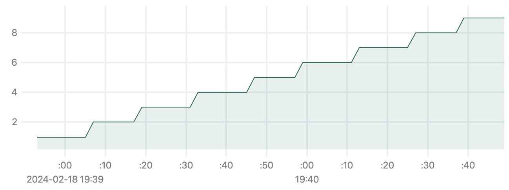

# Индекс
Использовался индекс `GIN`, поскольку позволяет эффективно искать с оператором `LIKE`
```sql
create index first_name_second_name on users using gin(first_name gin_trgm_ops, second_name gin_trgm_ops);

explain select id, password, first_name, second_name, birthday, city, biography
        from users
        where first_name LIKE '%рам%' and second_name LIKE '%дам%'
        order by id

Sort  (cost=36.03..36.03 rows=1 width=147)
      Sort Key: id
  ->  Bitmap Heap Scan on users  (cost=32.00..36.02 rows=1 width=147)
        Recheck Cond: ((first_name ~~ '%рам%'::text) AND (second_name ~~ '%дам%'::text))
        ->  Bitmap Index Scan on first_name_second_name  (cost=0.00..32.00 rows=1 width=0)
              Index Cond: ((first_name ~~ '%рам%'::text) AND (second_name ~~ '%дам%'::text))

```

# Результаты замеров

## Без индекса

### 1-10 одновременных запросов
#### Количество одновременных запросов

#### Время ответа

#### Пропускная способность


### 10-100 одновременных запросов
#### Количество одновременных запросов

#### Время ответа

#### Пропускная способность


### 100-1000 одновременных запросов
#### Количество одновременных запросов

#### Время ответа

#### Пропускная способность


## С индексом
### 1-10 одновременных запросов
#### Количество одновременных запросов

#### Время ответа

#### Пропускная способность


### 10-100 одновременных запросов
#### Количество одновременных запросов

#### Время ответа

#### Пропускная способность


### 100-1000 одновременных запросов
#### Количество одновременных запросов

#### Время ответа

#### Пропускная способность

