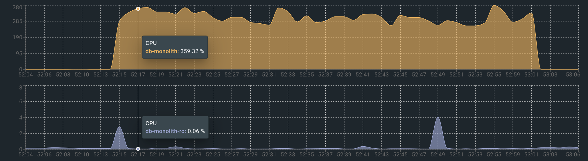
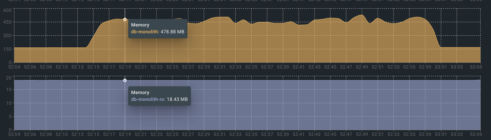
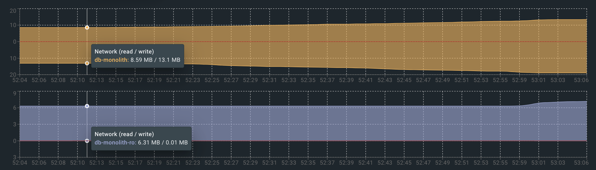
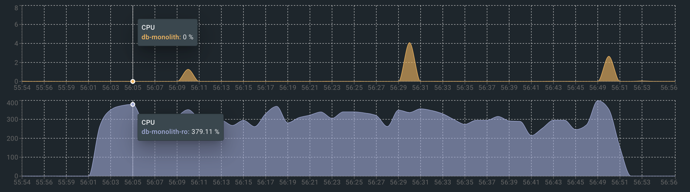
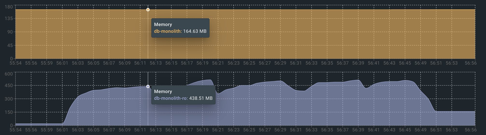
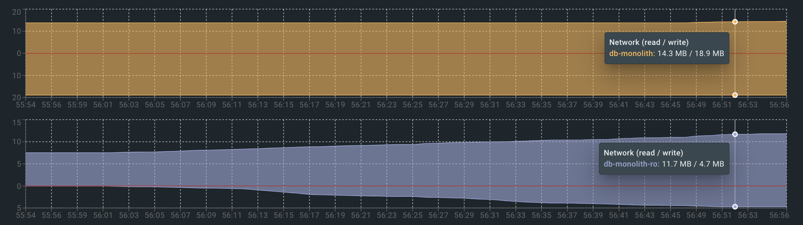

# Создание реплик
## Подготовка

1. Поднять мастер (`db-monolith-master`) и поправить его `postgresql.conf`:
    ```bash
    ssl = off
    wal_level = replica
    max_wal_senders = 4 # expected slave num
    ```
2. Подключиться к мастеру и создать пользователя для репликации
3. Добавить запись в `pg_hba.conf` c subnet нетворка контейнеров
4. Создать бэкап для реплик

## Добавление асинхронной реплики
1. Скопировать бэкап в volumes реплики `volumes/db-monolith-ro-async/`
2. Создать в `volumes/db-monolith-ro-async/` файл `standby.signal`
3. Поправить `postgresql.conf` реплики:
    ```bash
    primary_conninfo = 'host=db-monolith-master port=5432 user=replicator password=pass application_name=db-monolith-ro-async'
    ```
4. Поднять контейнер реплики
5. Проверить на мастере что все создалось:
   ```sql
   postgres=# select application_name, sync_state from pg_stat_replication;
      application_name   | sync_state
   ----------------------+------------
    db-monolith-ro-async | async
   ```

## Добавление синхронной реплики
1. Скопировать бэкап в volumes реплики `volumes/db-monolith-ro-sync/`
2. Создать в `volumes/db-monolith-ro-sync/` файл `standby.signal`
3. Поправить `postgresql.conf` реплики:
    ```bash
    primary_conninfo = 'host=db-monolith-master port=5432 user=replicator password=pass application_name=db-monolith-ro-sync'
    ```
4. Поправить `postgresql.conf` мастере:
   ```bash
   synchronous_commit = on
   synchronous_standby_names = '"db-monolith-ro-sync"'
   ```
5. Проверить на мастере что все создалось:
   ```sql
   postgres=# select application_name, sync_state from pg_stat_replication;
   application_name   | sync_state
   ----------------------+------------
    db-monolith-ro-async | async
    db-monolith-ro-sync  | sync
   ```

# Тестирование чтения с мастера и реплики

### Чтение с мастера
#### CPU

#### Memory

#### Network


### Чтение с реплики
#### CPU

#### Memory

#### Network


Как итог видно, что в случае чтения с реплики нагрузка с мастера ушла на реплику

# Тестирование отключения мастера

Проводилось на конфигурации с мастером и асинхронной + синхронной репликами:
   ```sql
   postgres=# select application_name, sync_state from pg_stat_replication;
   application_name   | sync_state
   ----------------------+------------
    db-monolith-ro-async | async
    db-monolith-ro-sync  | sync
   ```

1. Создаем таблицу test и начинаем бесконечно в нее писать
2. Убиваем мастер
   ```bash
   docker kill --signal=9 db-monolith-master
   ```
3. Успели записать в мастер 442 записи
4. Промоутим синхронный слейв до мастера через 
   ```sql
   select pg_promote();
   ```
5. Настраиваем асинхронную реплику на новый мастер:
   ```bash
   primary_conninfo = 'host=db-monolith-ro-sync port=5432 user=replicator password=pass application_name=db-monolith-ro-async'
   ```
6. Проверим на `db-monolith-ro-sync` что асинхронная реплика теперь у него:
   ```sql
   postgres=# select application_name, sync_state from pg_stat_replication;
      application_name   | sync_state
   ----------------------+------------
    db-monolith-ro-async | async
   ```
7. Проверяем сколько записалось данных на реплики:

   `db-monolith-ro-sync`:
   ```sql
   master=# select count(1) from test;
   count
   -------
      442
   (1 row)
   ```   
   `db-monolith-ro-async`:
   ```sql
   master=# select count(1) from test;
   count
   -------
      442
   (1 row)
   ```
8. Данные не были потеряны